# Summary

* [Installing React Native CLI (Windows - Android)](#installing)
    * [Node, Python2 and JDK via Chocolatey](#nodePythonJdk)
    * [React Native CLI](#reactNativeCli)
    * [Android Studio](#androidStudio)
    * [Android SDK](#androidSdk)
    * [Configure the ANDROID_HOME environment variable](#androidHome)
* [Creating a new application and running the project](#newProject)
* [Debugging](#debug)
    * [Developer Menu](#developerMenu)
    * [Other Debugging tools](#otherDebugging)
* [Project Structure and Dependencies](#projectStructureDependencies)
    * [Structure](#structure)
    * [Dependencies](#dependencies)
    * [Dev Dependencies](#devDependencies)
    * [ESlint](#eslint)
* [Know Issues](#issues)


# <a name="installing"></a> Installing React Native CLI (Windows - Android)

Instead of following this instalation part, you can check the original documentation [here](https://facebook.github.io/react-native/docs/getting-started).

## <a name="nodePythonJdk"></a> Node, Python2 and JDK via Chocolatey

Installing [Chocolatey](https://chocolatey.org/install)
* Run command line as an administrator.
* Run `@"%SystemRoot%\System32\WindowsPowerShell\v1.0\powershell.exe" -NoProfile -InputFormat None -ExecutionPolicy Bypass -Command "iex ((New-Object System.Net.WebClient).DownloadString('https://chocolatey.org/install.ps1'))" && SET "PATH=%PATH%;%ALLUSERSPROFILE%\chocolatey\bin"`.


Installing [Node](https://nodejs.org/en/), [Python2](https://www.python.org/downloads/) and [JDK](https://www.oracle.com/technetwork/java/javase/downloads/jdk8-downloads-2133151.html) 
* Run on command line `choco install -y nodejs.install python2 jdk8` 

> If you have already installed Node on your system, make sure it is Node 8.3 or newer.    
> If you already have a JDK on your system, make sure it is version 8 or newer.

## <a name="reactNativeCli"></a> React Native CLI

Run on command line `npm install -g react-native-cli`    

## <a name="androidStudio"></a> Android Studio

Download and Install [Android Studio](https://developer.android.com/studio/index.html)
* Choose a `Custom` Setup
* Make sure the following are checked     
    - [x] Android SDK      
    - [x] Android SDK Platform     
    - [x] Performance (Intel ® HAXM) [See here for AMD](https://android-developers.googleblog.com/2018/07/android-emulator-amd-processor-hyper-v.html)
    - [x] Android Virtual Device     
 
> You can also choose Standart Setup and download what is missing after.
> If the checkboxes are grayed out or you can't select it, you will have a chance to install these components later on. Check [here](#sdkTools).

## <a name="androidSdk"></a> Android SDK

To building a React Native app with native code requires the `Android 9 (Pie)` SDK in particular.     
Additional Android SDKs can be installed through.     
The SDK Manager can be accessed from the `Welcome to Android Studio` screen or in Android Studio `Preferences` dialog.

* Open **Android Studio**    
* Click `Configure`.

> If you don't see this view, go [here](#projectView)    

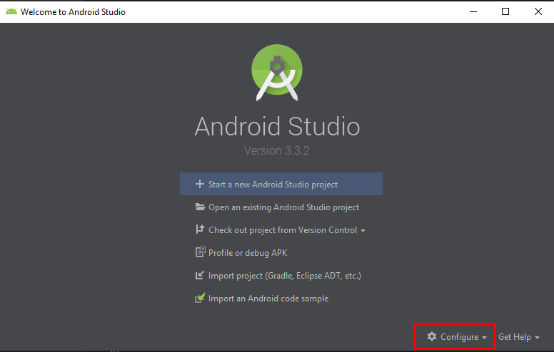    


* Select `SDK Manager`.

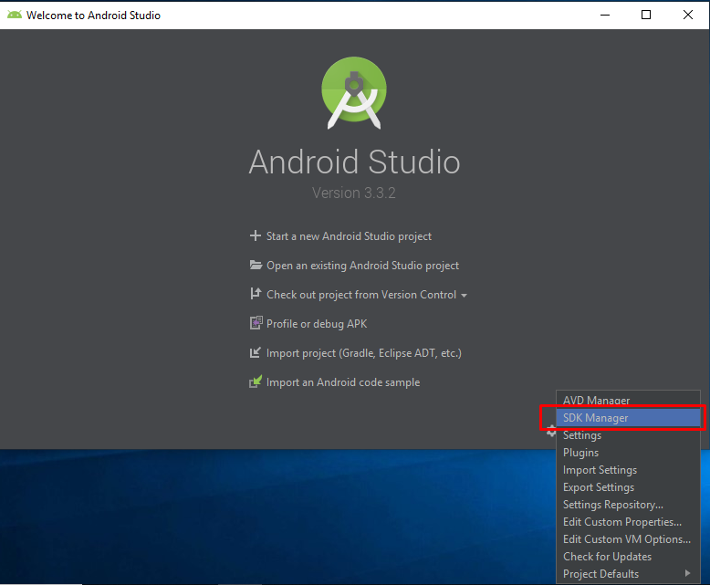 

> <a name="projectView"></a> If you don't see the `Welcome Screen` Click the `SDK Manager` icon on the top right 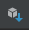 

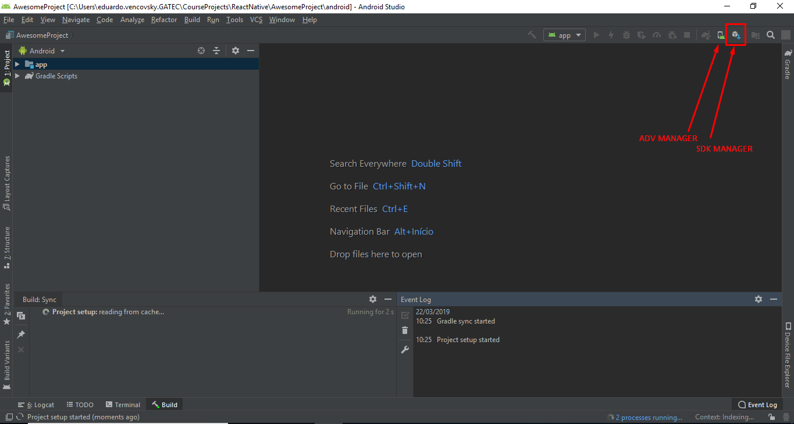

* `Appearance & Behavior` → `System Settings` → `Android SDK`.
* Select `SDK Plataforms`.
* Make sure `Show Packages Details` is selected.

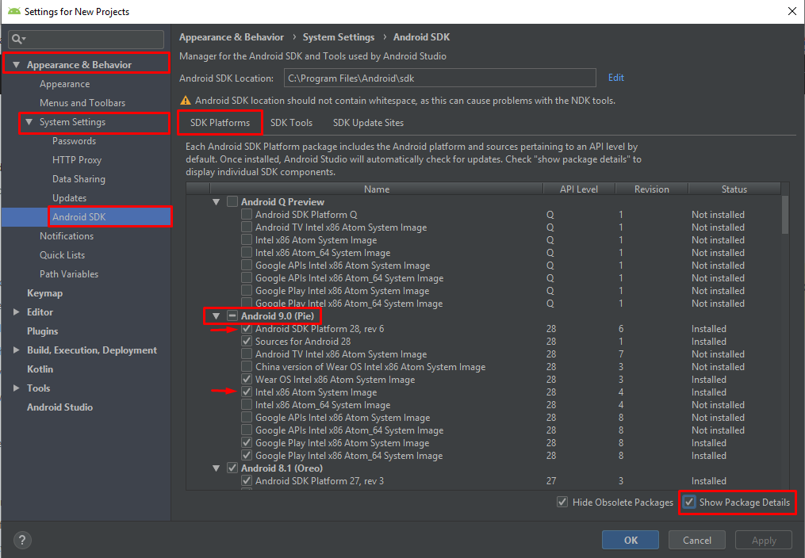   

* Make sure the following are checked
    - [x] `Android SDK Platform 28`    
    - [x] `Intel x86 Atom_64 System Image` or `Google APIs Intel x86 Atom System Image`      

* Select `SDK Tools`
* Make sure `Show Packages Details` is selected.

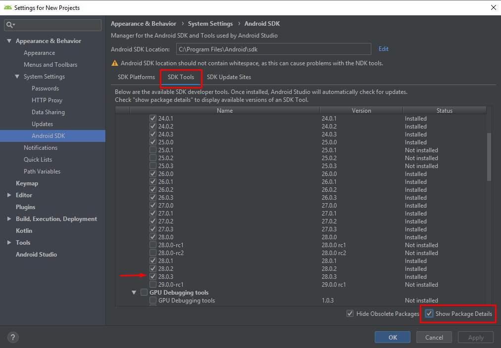    

* Make sure `28.0.3` is selected.

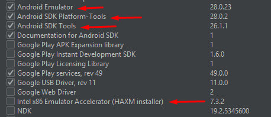 

* Make sure the following are checked
    - [x] `Android Emulator`    
    - [x] `Android SDK Plataform-Tools`    
    - [x] `Android SDK Tools` 
    - [x] `Intel x86 Emulator Accelerator (HAXM installer)`  

* Click `Apply` and proceed with the installation.

> If you are getting problems installing, see the [know issues](#issues).

## <a name="androidHome"></a> Configure the ANDROID_HOME environment variable

* Open `Control Panel` in the Windows.
* Click `System and Security`.

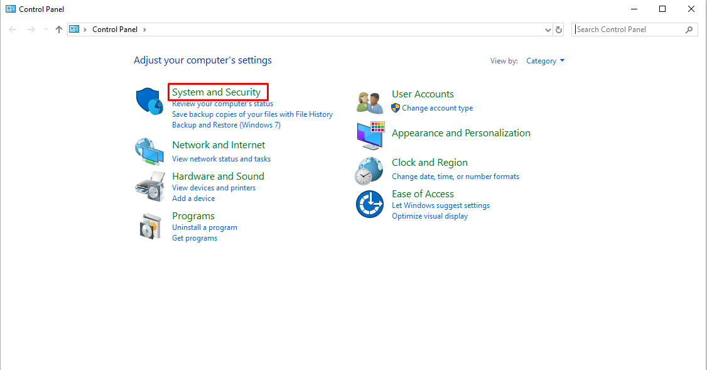 

* Click `System`.

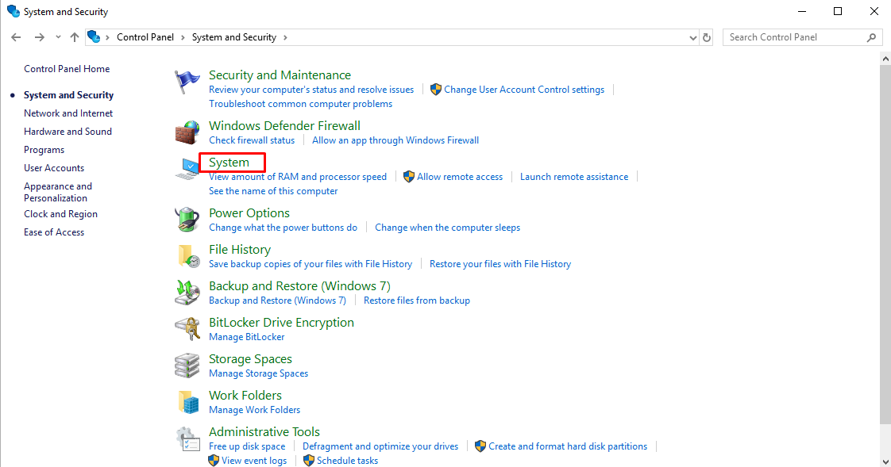 

* Click `Advanced System Settings`.

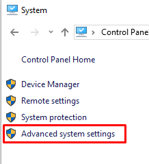 

* Click `Environment Variables`.

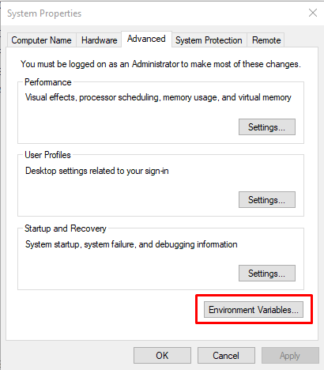 

* Create a new `ANDROID_HOME` user variable that points to the path to your `Android SDK`.

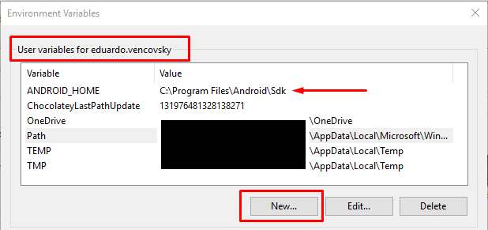 

> The SDK is installed, by default, at the following location:    
> `C:\Users\YOUR_USERNAME\AppData\Local\Android\Sdk`

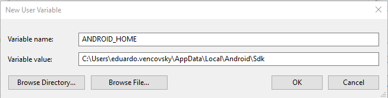 

* Select the `Path` variable.

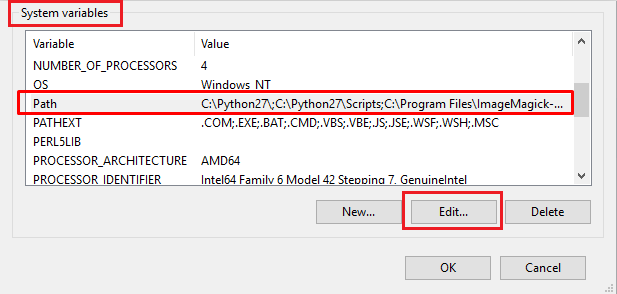 

* Click `New` and add the path to `platform-tools` to the list.

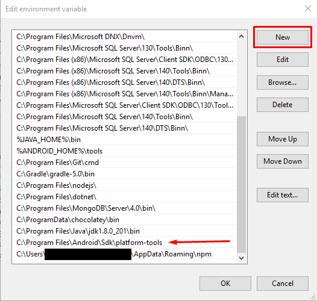 

> The default location for this folder is:    
> `C:\Users\YOUR_USERNAME\AppData\Local\Android\Sdk\platform-tools`

# <a name="newProject"></a> Creating a new application and running the project

* Run on command line `react-native init PROJECT_NAME`.

> If you are getting problems with `react-native` command, see the [know issues](#issues).

* Go in your project folder `cd PROJECT_NAME` and Run `react-native run-android` to run your project.

* **Make sure your device is open/connected**

* To run on Physical Device check [here](https://facebook.github.io/react-native/docs/running-on-device)

* To run on Virtual Device check [here](https://facebook.github.io/react-native/docs/getting-started#using-a-virtual-device)

# <a name="debug"></a> Debugging

You can check [React Native Debugging](https://facebook.github.io/react-native/docs/debugging) for more information.

## <a name="developerMenu"></a> Developer Menu

Press `Ctrl M` if you are running on a Virtual device or shake your phone if it's a physical device to open `Developer Menu`.   

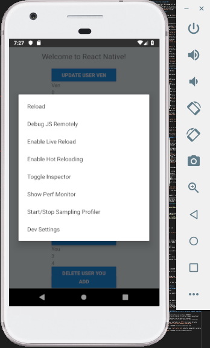  

* Debug JS Remotely

> This will open a tab in `http://localhost:8081/debugger-ui/` where you can debug and see the console.    
> This can slow your app rendering.     
> To only see the `console.log` of your app, you can run `react-native log-android` in a new terminal.

* <a name="liveReload"></a>Enable Live Reload (Recommended)

> Enabling Live Reload makes you app automatically reload once you save a file.

* Enable Hot Reload

> Enabling Hot Reload makes you app automatically reload once you change a file.

## <a name="otherDebugging"></a> Other Debugging tools

You can also use the standalone version of [react-devtools](https://github.com/facebook/react-devtools/tree/master/packages/react-devtools)

# <a name="projectStructureDependencies"></a> Project Structure and Dependencies

## <a name="structure"></a> Structure 

All of the source code should be inside `src` folder in the root.

```
src
|   
│
└── components
│   │
│   └── COMPONENT_NAME
│   |   |   COMPONENT_NAME.js
│   |   │   styles.js
│   |      
│   |   ...  
|
|
└── hooks
|   │   basicHooks.js
|   │   ...
|
|
└── services
|   |   VIEW_NAMEService.js
|   |   ...
|
|
└── styles
|   |   generalUsedStyle.js
|   |   componentsTheme.js
|   |   viewsTheme.js
|   |   ...
|
|
└── utils
|   |   somethingUtil.js
|   |   ...
|
|
└── views
    |  
    └── VIEW_NAME
    |   |   VIEW_NAME.js
    |   |   styles.js
    |   |
    |   └── SUB_VIEW_NAME
    |       |   SUB_VIEW_NAME.js
    |       |   styles.js
    |   
    |   ...

```

**Components** 

This folder is for all components that can be used in other screens and should have the following.
* A `.js` file to the components, named by the component name.
* A `style.js` file with all of the components style.

**Hooks** 

This folder is to store hooks, each hooks file should be grouped by some logic.

> Hooks are a new thing in react. To learn more about it, see the [documentation](https:// reactjs.org/docs/hooks-intro.html).   
> It's used to reuse stateful logic between components. The same way components are used to reuse renderable objects between views, hooks do the same but with stateful logic.    

**Services** 

This folder is where the view calls to an API or external sources (Local DB).

* Each View should have it's own service.    
* **Shouldn't have more services than views**, but some views can have no service.
* Services can call other services (Be careful with Infinty Loops).

**Styles** 

This Folder is to store styles that are used through multiple places in the project and to standardize the project styles. (e.g. used colors in the project).

* Each View should have it's own service.    
* **Shouldn't have more services than views**, but some views can have no service.
* Services can call other services (Be careful with Infinty Loops)

**Utils**

This folder is to store functions that you will use across all the project. It's like Hooks, but while Hooks is for statefull logic, this folder is to store any function.

**Views** 

This folder is where you have all of your views that will be used by some type of navigation.    

* It have folders with the name of each View. 
* Each View Folder have a `.js` file named by the view's name.
* Each View Folder have a `styles.js` file with the view's component.
* If you have subviews (e.g. modals), you should create a new folder inside the view's folder with the same structure.

## <a name="dependencies"></a> Dependencies

List of Packages that are used.
- [x] [`react-native-action-button`](https://github.com/mastermoo/react-native-action-button)
    * Create Floating Button on left corner of the screen.
    * Can create Nested Buttons around Floating Button.
- [x] [`react-native-elements`](https://react-native-training.github.io/react-native-elements/)
    * Have alot of ready to use Components
    * Also have Implementations of Native Components
- [x] [`react-native-vector-icons`](https://github.com/oblador/react-native-vector-icons)
    * Have multiple types of Icons.
    * Dependencie of `react-native-action-button` and `react-native-elements`.
- [x] [`react-navigation`](https://reactnavigation.org/)
    * Create Navigation on your App.
    * Also have other types of handling Views.
- [x] [`react-native-gesture-handler`](https://kmagiera.github.io/react-native-gesture-handler/docs/getting-started.html)
    * Gesture Handler aims to replace React Native's built in touch system
    * Dependencie of `react-navigation`

**Installing packages**

If you already have all of this packages in your `package.json`, you can run `npm i` or `npm install`

Or you can install each one by running:    

    npm i --save react-native-elements 
    npm i --save react-native-action-button 
    npm i --save react-native-vector-icons 
    npm i --save react-navigation 
    npm i --save react-native-gesture-handler 

Some packages need more than just using `npm install`

**Linking packages**

* `react-native link react-native-vector-icons`
* `react-native link react-native-gesture-handler`

`react-native-gesture-handler` also needs you to add some changes to your `MainActivity.java`

```java
package com.swmansion.gesturehandler.react.example;

import com.facebook.react.ReactActivity;
+ import com.facebook.react.ReactActivityDelegate;
+ import com.facebook.react.ReactRootView;
+ import com.swmansion.gesturehandler.react.RNGestureHandlerEnabledRootView;

public class MainActivity extends ReactActivity {

  @Override
  protected String getMainComponentName() {
    return "Example";
  }

+  @Override
+  protected ReactActivityDelegate createReactActivityDelegate() {
+    return new ReactActivityDelegate(this, getMainComponentName()) {
+      @Override
+      protected ReactRootView createRootView() {
+       return new RNGestureHandlerEnabledRootView(MainActivity.this);
+      }
+    };
+  }
}

```

> Lines with `+` are the added code

### <a name="devDependencies"></a> Dev Dependencies

An essencial dev dependency is `prop-types`

`npm i -D prop-types`

### <a name="eslint"></a> ESLint

If you are using Visual Studio (very recommended), you need to install [Eslint Extension](https://marketplace.visualstudio.com/items?itemName=dbaeumer.vscode-eslint) and also install the following packages:    

    npm i -D eslint
    npm i -D eslint-plugin-react
    npm i -D eslint-plugin-react-hooks
    npm i -D babel-eslint

To run eslint from terminal you need to install the packages globally:    

    npm i -g eslint
    npm i -g eslint-plugin-react
    npm i -g babel-eslint
    npm i -g eslint-plugin-react-hooks

Now you can check for linting using the command:   

    eslint FILE_TO_LINT

> e.g.:   
> 
>       eslint .
>
> 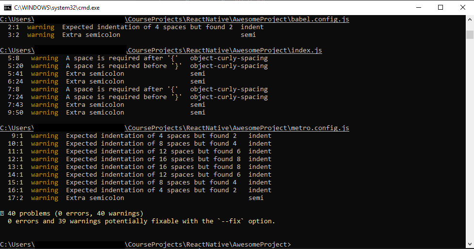     
>
> Lint current folder and show all lint warnings and errors

# <a name="issues"></a> Know Issues

## Can't Install SDK Plataform Package

- Intel x86 Atom_64 System Image

    > Run `Android Studio` as an administrator.

## Can't Install SDK Tools

- Performance (Intel ® HAXM)    

    > Run `Android Studio` as an administrator.    

    > If it's still not working, you can install it manually from [here](https://github.com/intel/haxm/releases).     
    > Also check [here](https://github.com/intel/haxm/wiki/Installation-Instructions-on-Windows) to see installation steps.
    > Select the lastest `Release` and download `haxm-windows_vx_x_x.zip`. **The file name may change.*

## 'react-native' is not recognized as an internal or external command, operable program or batch file.

> [StackOverflow 1](https://stackoverflow.com/questions/38889487/react-native-is-not-recognized-as-an-internal-or-external-command-operable-pr)  

> [StackOverflow 2](https://stackoverflow.com/questions/54052801/react-native-installation-generates-error-as-react-native-is-not-recognized)  

> If it still not work, add your npm folder to `PATH` Environment Variable   
> Normally it's located at `C:Users\USER_NAME\AppData\Roaming\npm` 
>
> 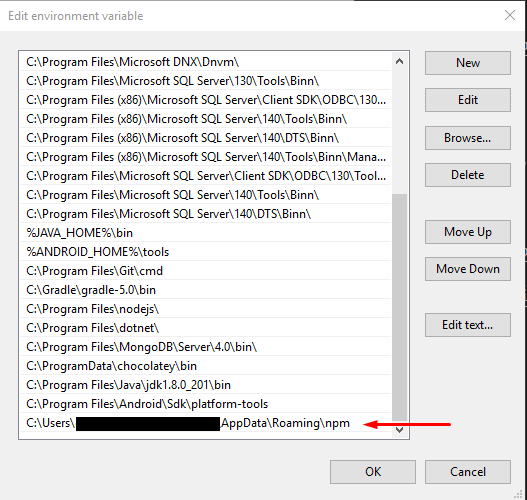    
>
> In this folder, you will have `react-native.cmd` and other npm global variables
>
> 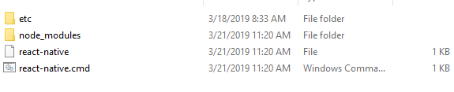 

## Why the app isn't realoading when I save an file?

> Don't forget to [Enable Live Reload](#liveReload)

## Remote debugger is in a background tab which may cause apps to perform slowly. Fix this by foregrounding the tab (or opening it in a separate window).

> [StackOverflow](https://stackoverflow.com/a/41268817/9119186)

> Just move the debugger to a separate window

## npm start -- --reset-cache

## Could not connect to development server 

> [Try This](https://facebook.github.io/react-native/docs/running-on-device#method-1-using-adb-reverse-recommended)    

> [Also check here](https://github.com/facebook/react-native/issues/15388)